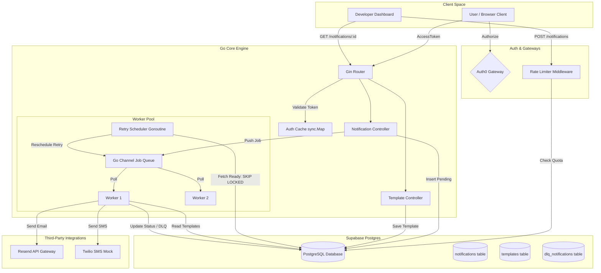

# Notification Engine Monolith (V2 SaaS)

A highly resilient, production-grade Go notification scheduler and queue service featuring multi-tenant Auth0 isolation, PostgreSQL concurrency primitives, exponential backoff retries, and real-time dashboard analytics.

---

## ⚡ Key Technical Features

### 1. Database Concurrency & Worker Pools
- **Atomic Queue Acquisition**: Employs PostgreSQL transactional queries with `FOR UPDATE SKIP LOCKED` locking clauses to execute task claiming safely across horizontal worker nodes.
- **Partial Indexing**: Leverages targeted database indexes (`WHERE status = 'PENDING'`) to limit search ranges, keeping index sizes small and RAM-resident even at millions of logs.

### 2. Distributed Resiliency
- **Exponential Backoff**: Delays retries dynamically (2<sup>retry_count</sup> seconds) on transit delivery faults to protect downstream partner servers.
- **Dead Letter Queue (DLQ)**: Quarantines persistent failures in an isolated archival table for diagnostic logs audits.

### 3. Identity & API Security
- **Auth0 Multitenancy**: Restricts template queries and notification audits securely. Users can only view or manage records owned by their Auth0 sub claims.
- **JWT Validation Cache**: Uses a local thread-safe `sync.Map` validation cache to save user profile validations, preventing latency penalties.
- **User-Scoped Rate Limiting**: Scopes Fixed Window rate limiter tokens directly to the authenticated user ID (falling back to client IP).

### 4. Interactive Console Developer UI
- Uses Go's native `go:embed` filesystem utility to deliver a self-contained monolith build package.
- **Quota Progress Gauge**: Renders live rate-limit utilization states dynamically.
- **Live Terminal Console**: Streams real-time scheduler state log entries directly to the dashboard.

---

## 🖼 System Architecture



---

## 📂 Folder Organization

```text
NotificationService/
├── .github/
│   └── workflows/
│       └── ci.yml             # CI/CD Pipeline (Go Tests & GHCR Build/Push)
├── cmd/
│   └── server/
│       └── main.go            # Application entrypoint & dependency injection
├── internal/
│   ├── config/
│   │   └── config.go          # Config specs mapping Environment Variables
│   ├── database/
│   │   ├── migrate.go         # SQL Migration driver initialization
│   │   └── postgres.go        # PostgreSQL simple protocol connections pooler
│   ├── domain/
│   │   └── notification.go    # Core structures (Notification, Template, Enums)
│   ├── handler/
│   │   ├── notification.go    # REST Controllers for notifications
│   │   └── template.go        # REST Controllers for template builders
│   ├── middleware/
│   │   └── auth.go            # Auth0 token validator & local sync.Map cache
│   ├── ratelimit/
│   │   └── middleware.go      # Fixed Window user-scoped rate limiting
│   ├── repository/
│   │   ├── postgres/
│   │   │   ├── dlq_repository.go          # Dead-letter queue repository queries
│   │   │   ├── notification_repository.go # Atomic status update queries (SKIP LOCKED)
│   │   │   └── template_repository.go     # Template fallback & override select queries
│   │   ├── notification_repository.go     # Repository interface abstractions
│   │   └── template_repository.go
│   ├── router/
│   │   ├── router.go          # Gin routes registration & static embedding
│   │   └── web/
│   │       ├── index.html     # Developer Dashboard Console HTML/JS
│   │       └── landing.html   # Monolith SaaS Landing Page
│   └── service/
│       └── system.go          # Background Worker Pool & Retry Scheduler loop
├── migrations/                # Schema migrations scripts (001 to 004)
├── Dockerfile                 # Multi-stage production container build schema
├── docker-compose.yml         # Local stack deployment orchestration configurations
└── troubleshooting_journal.md # System logs documenting resolved low-level issues
```

---

## 📖 API Documentation

### Authentication Header
All `/api/v1` routes require an Auth0 JWT access token passed via the HTTP header:
```http
Authorization: Bearer <your_jwt_access_token>
```

---

### 1. Notifications

#### 📥 Create Notification (Enqueue)
* **Endpoint**: `POST /api/v1/notifications`
* **Rate Limited**: Yes (Max 20 requests / 24 hrs by default)
* **Request Payload**:
```json
{
  "recipient": "sanjayvelu147@gmail.com",
  "template": "MFA",
  "type": "EMAIL",
  "variable": {
    "code": "847291"
  }
}
```
* **Success Response** (`202 Accepted`):
```json
{
  "id": "c0e9520b-d5e9-468b-a51d-11a264f17ee4",
  "recipient": "sanjayvelu147@gmail.com",
  "template": "MFA",
  "variable": {
    "code": "847291"
  },
  "retry_count": 0,
  "created_at": "2026-07-06T13:27:35Z",
  "type": "EMAIL",
  "status": "PENDING",
  "next_retry_at": "2026-07-06T13:27:35Z",
  "error_message": ""
}
```

#### 🔍 Get Notification Status (Polling)
* **Endpoint**: `GET /api/v1/notifications/:id`
* **Rate Limited**: No (Allows dashboard real-time status polling)
* **Success Response** (`200 OK`):
```json
{
  "id": "c0e9520b-d5e9-468b-a51d-11a264f17ee4",
  "recipient": "sanjayvelu147@gmail.com",
  "template": "MFA",
  "variable": {
    "code": "847291"
  },
  "retry_count": 3,
  "created_at": "2026-07-06T13:27:35Z",
  "type": "EMAIL",
  "status": "DLQ",
  "next_retry_at": "2026-07-06T13:27:51Z",
  "error_message": "resend API returned error (status 403): You can only send testing emails..."
}
```

---

### 2. Templates

#### 💾 Create / Overwrite Template
* **Endpoint**: `POST /api/v1/templates`
* **Rate Limited**: Yes
* **Request Payload**:
```json
{
  "name": "BILLING_SUCCESS",
  "body": "Hi {{name}}, we successfully processed your subscription payment of {{amount}}."
}
```
* **Success Response** (`200 OK`):
```json
{
  "status": "saved"
}
```

#### 📋 Get All Accessible Templates
* **Endpoint**: `GET /api/v1/templates`
* **Rate Limited**: No
* **Description**: Returns all default global templates combined with any user-specific overrides.
* **Success Response** (`200 OK`):
```json
{
  "WELCOME": "Welcome to our service, {{name}}! We are glad to have you.",
  "MFA": "Your security code is: {{code}}. This code is valid for 5 minutes.",
  "BILLING_SUCCESS": "Hi {{name}}, we successfully processed your subscription payment of {{amount}}."
}
```

---

## 🏛 Key Design Decisions & Code Comments

### 1. PgBouncer Compatibility: Simple Protocol Mode
- **Decision**: Forced database client connections to use `QueryExecModeSimpleProtocol`.
- **Rationale**: Direct transaction poolers (like Supabase's port `6543`) route queries to random physical server sockets. Since standard drivers cache statement OIDs on specific connections, statement mismatch collisions (`SQLSTATE 42P05`) occur. Simple protocol compiles and runs SQL dynamically without caching statements, restoring full proxy compatibility.

### 2. Concurrency Safety: `FOR UPDATE SKIP LOCKED`
- **Decision**: Claims ready tasks using database locking flags.
- **Rationale**: When multiple instances of the monolith run in a cluster, they compete for ready tasks. By locking acquired rows and skipping locked columns (`SKIP LOCKED`), different servers process independent task batches simultaneously without double-delivery races.

### 3. Rate Limiter Scoped Routing
- **Decision**: Scoped the rate limit middleware exclusively to write/mutation endpoints (`POST /notifications` and `POST /templates`).
- **Rationale**: Polling status endpoints are frequently checked by dashboards. Applying limits to `GET` routes quickly exhausts a user's API quota on normal visual updates. Restricting limits to write routes protects email/SMS provider budgets from spam while maintaining continuous UI updates.

---

## 🚀 Quick Start

1. Create a local `.env` file (copied from `.env.example`) and inject your Resend API Key:
   ```env
   RESEND_API_KEY=re_MfLT8nBm_...
   AUTH0_DOMAIN=dev-i6avz7x124upwug6.us.auth0.com
   ```
2. Build and start the container stack:
   ```bash
   docker compose up --build
   ```
3. Open your browser in an **Incognito Window** (to clear old redirect caches) and visit:
   👉 **`http://localhost:8080/`**
