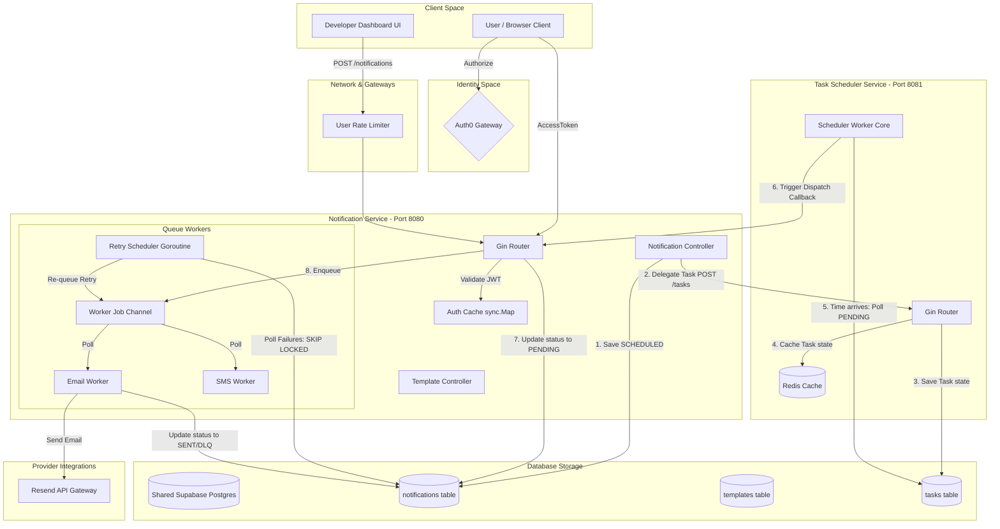

# Notification Service & Task Scheduler Monorepo (V2 SaaS)

A highly resilient, production-grade Go monorepo housing two distributed microservices: the **Notification Service** (email/SMS dispatcher) and the **Task Scheduler** (webhook callback orchestrator). The system features multi-tenant Auth0 isolation, PostgreSQL transactional concurrency primitives, exponential backoff retries, Redis-backed task states, and a real-time developer analytics dashboard.

---

## ⚡ Key Technical Features

### 1. Monorepo Microservice Architecture
- **Notification Engine (`cmd/notification-service`)**: Exposes public-facing API endpoints, serves the HTML dashboard UI, validates Auth0 JWT signatures, manages templates, and processes email/SMS queue workers.
- **Task Scheduler (`cmd/task-scheduler`)**: A decoupled backend service that registers webhook execution targets (`execute_at`) and triggers HTTP POST requests at precise times.

### 2. Gateway-Delegated Scheduling Flow
- **Single Public API**: Clients schedule emails by simply checking a box on the dashboard, posting to `POST /api/v1/notifications` with an optional `execute_at` timestamp.
- **Secure Delegation**: The Notification Engine acts as a gateway; it creates a `SCHEDULED` notification record, and securely delegates the timer task to the `task-scheduler` microservice.
- **Secret Webhook Callback**: When the target time is reached, the Task Scheduler triggers `POST /api/v1/internal/notifications/:id/dispatch` with internal API Key authorization, prompting the engine to execute immediate delivery.

### 3. Concurrency safety & Caching
- **Atomic Claiming**: Both microservices leverage PostgreSQL transactional queries with `FOR UPDATE SKIP LOCKED` clauses to prevent double-claiming race conditions.
- **Redis Integration**: The Task Scheduler uses Redis as a lock-free distributed cache to store fast state transitions.
- **JWT Validation Cache**: Uses a local thread-safe `sync.Map` validation cache in the gateway to minimize Auth0 remote key retrieval latency.

---

## 🖼 System Architecture



---

## 📂 Folder Organization

```text
NotificationService/
├── .github/
│   └── workflows/
│       └── ci.yml                  # CI/CD Pipeline (Go Tests & Double GHCR Build/Push)
├── cmd/
│   ├── notification-service/
│   │   └── main.go                 # Gateway entrypoint & notification dispatcher
│   └── task-scheduler/
│   │   └── main.go                 # Task scheduler microservice daemon
├── internal/
│   ├── config/
│   │   └── config.go               # Config parser mapping Monorepo env variables
│   ├── database/
│   │   ├── migrate.go              # SQL Migration initialization
│   │   └── postgres.go             # Simple protocol connections pooler
│   ├── domain/
│   │   └── notification.go         # Domain enums & entity schemas (SCHEDULED status)
│   ├── handler/
│   │   ├── notification_handler.go # REST controllers for dispatches & callback loops
│   │   └── template_handler.go     # REST controllers for templates
│   ├── middleware/
│   │   └── auth.go                 # Auth0 JWT validator & validation cache
│   ├── ratelimit/
│   │   └── middleware.go           # Fixed Window user-scoped rate limiting
│   ├── repository/
│   │   ├── postgres/               # DB repositories implementations
│   │   └── notification_repository.go
│   ├── router/
│   │   ├── router.go               # Gin routes registration
│   │   └── web/
│   │       ├── index.html          # Console dashboard containing schedule inputs
│   │       └── landing.html        # Monolith SaaS landing page
│   ├── scheduler/                  # Task Scheduler Microservice logic
│   │   ├── config/                 # Redis & DB configs parser
│   │   ├── domain/                 # Task domain models
│   │   ├── handler/                # Task API routes
│   │   ├── middleware/             # API Key token auth validator
│   │   ├── repository/             # DB & Redis state repositories
│   │   ├── service/                # Task workers queue tick loops
│   │   └── tests/                  # Scheduler E2E testing scenarios
│   └── service/
│       └── system.go               # Notification core worker & scheduler clients
├── migrations/                     # Schema migrations scripts (001 to 004)
├── Dockerfile.notification         # Notification Service container configuration
├── Dockerfile.scheduler            # Task Scheduler Service container configuration
├── docker-compose.yml              # Local orchestration containing Postgres & Redis
└── troubleshooting_journal.md      # Low-level systems debug log journals
```

---

## 📖 API Documentation

### Authentication Header
All `/api/v1` routes (excluding internal callbacks) require an Auth0 JWT access token:
```http
Authorization: Bearer <your_jwt_access_token>
```

---

### 1. Notification Dispatch

#### 📥 Dispatch / Schedule Notification
* **Endpoint**: `POST /api/v1/notifications`
* **Rate Limited**: Yes
* **Payload Structure**:
```json
{
  "recipient": "sanjayvelu147@gmail.com",
  "template": "MFA",
  "type": "EMAIL",
  "variable": {
    "code": "847291"
  },
  "execute_at": "2026-07-07T18:30:00Z" // Optional RFC3339 string. If omitted, dispatches immediately.
}
```
* **Success Response** (`202 Accepted`):
```json
{
  "id": "c0e9520b-d5e9-468b-a51d-11a264f17ee4",
  "recipient": "sanjayvelu147@gmail.com",
  "template": "MFA",
  "variable": {
    "code": "847291"
  },
  "retry_count": 0,
  "created_at": "2026-07-07T12:15:00Z",
  "type": "EMAIL",
  "status": "SCHEDULED",
  "next_retry_at": "2026-07-07T18:30:00Z",
  "error_message": ""
}
```

#### 🔍 Get Notification Status (Polling)
* **Endpoint**: `GET /api/v1/notifications/:id`
* **Rate Limited**: No
* **Response** (`200 OK`): Returns the current state (e.g. `SCHEDULED`, `PENDING`, `SENT`, `DLQ`).

#### 🪝 Internal Dispatch Trigger Callback
* **Endpoint**: `POST /api/v1/internal/notifications/:id/dispatch`
* **Authentication**: Bearer token checking against internal `SCHEDULER_API_KEY`
* **Description**: Invoked by the `task-scheduler` microservice to initiate real-time delivery once the delay expires.

---

### 2. Task Scheduler API

#### 📅 Create Scheduler Task
* **Endpoint**: `POST /tasks`
* **Port**: `8081`
* **Authentication**: Bearer token checking against `SCHEDULER_API_KEY`
* **Payload Structure**:
```json
{
  "id": "task_notif_c0e9520b-d5e9-468b-a51d-11a264f17ee4",
  "title": "Send Email Dispatch",
  "callback_url": "http://notification-service:8080/api/v1/internal/notifications/c0e9520b-d5e9-468b-a51d-11a264f17ee4/dispatch",
  "payload": "{}",
  "execute_at": "2026-07-07T18:30:00Z"
}
```

---

## 🏛 Key Design Decisions & Code Comments

### 1. Monorepo Gateway Interface Pattern
To maximize browser performance and ensure security, we route scheduling through a single API gateway interface (the Notification Service). This prevents the client from exposing secrets or directly interfacing with the separate Task Scheduler API keys.

### 2. PgBouncer Compatibility: Simple Protocol Mode
Direct transaction poolers (such as Supabase Port `6543`) route queries to random database server sockets. Go's standard query protocol attempts to cache statement OIDs on specific connections, causing prepared statement collisions (`SQLSTATE 42P05`). We configure database connections to execute using `pgx.QueryExecModeSimpleProtocol` to disable statements compilation caching.

### 3. Concurrency Protection: `FOR UPDATE SKIP LOCKED`
Both microservices use `FOR UPDATE SKIP LOCKED` to locks row records when scanning queues. If multiple container replicas run concurrently, they skip locked columns, avoiding resource contention and preventing double-delivery.

---

## 🚀 Quick Start

1. Create a local `.env` file containing your secrets:
   ```env
   RESEND_API_KEY=re_MfLT8nBm_...
   AUTH0_DOMAIN=dev-i6avz7x124upwug6.us.auth0.com
   SCHEDULER_API_KEY=test_api_key_12345
   ```
2. Build and launch the container microservice stack locally:
   ```bash
   docker compose up --build
   ```
3. Open your browser in an **Incognito Window** (to prevent cache collisions) and visit:
   👉 **`http://localhost:8080/`**
